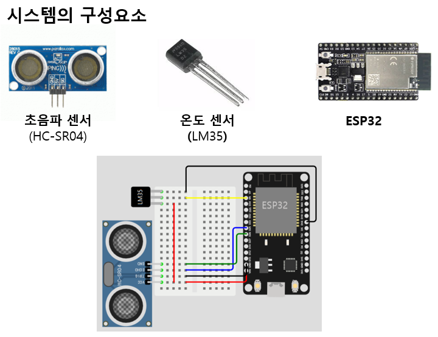
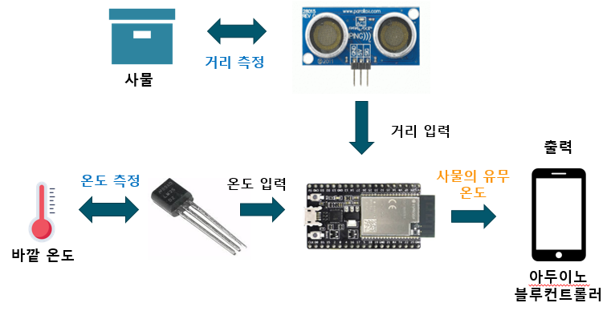
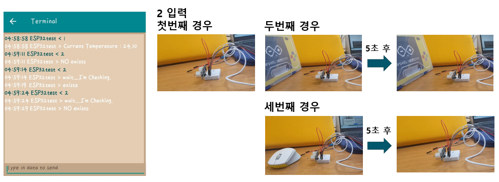

# ArduinoCommunication
컴퓨터구조 수업 실습

## 1. 시스템의 목적

### 구상 시스템
출입문의 사물을 알려주는 사물인터넷
### 구상 시스템
현관문 앞의 물건을 인식하고 밖의 온도를 측정한다

### 사용한 사물인터넷 기반 기술
1. 센서 및 엑츄에이터 기술
2. 통신 및 네트워킹 기술
3. 사용자 인터페이스 기술

## 2. 요구사항 분석

## 3. 설계
### 시스템구성요소

### 입출력다이어그램

## 4. 시험과정

